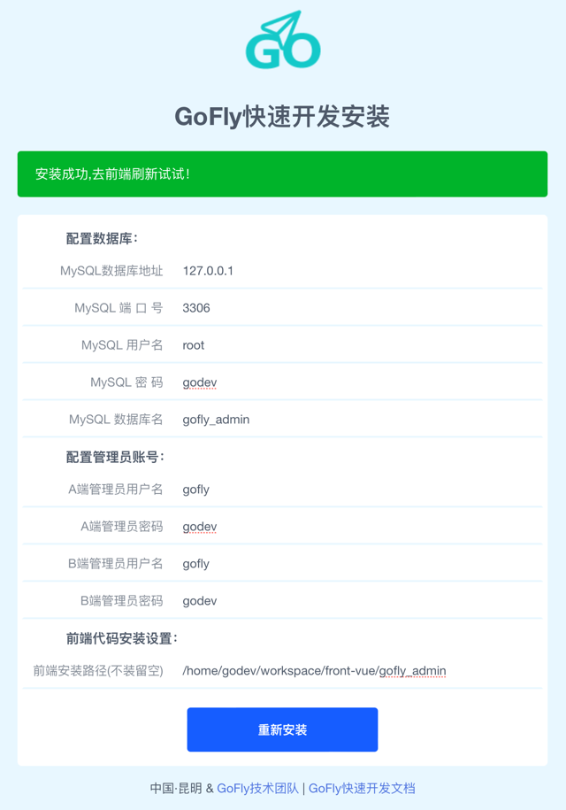

# 000安装GoFlyAdmin.md

```shell
## go热编译工具
### 1、bee run
#https://github.com/beego/bee
#go install github.com/beego/bee/v2@latest
#bee run
## 
### 2、air
#https://github.com/cosmtrek/air
#go install github.com/cosmtrek/air@latest
#air init
#air
## 
## 3、fresh
go install github.com/pilu/fresh@latest
fresh
## 
## 
```

## 安装截图
http://172.16.224.146:8105/common/install/index

```shell
## A端和B端账号
## 账号
gofly
## 密码
godev
## 
## 
## 
```